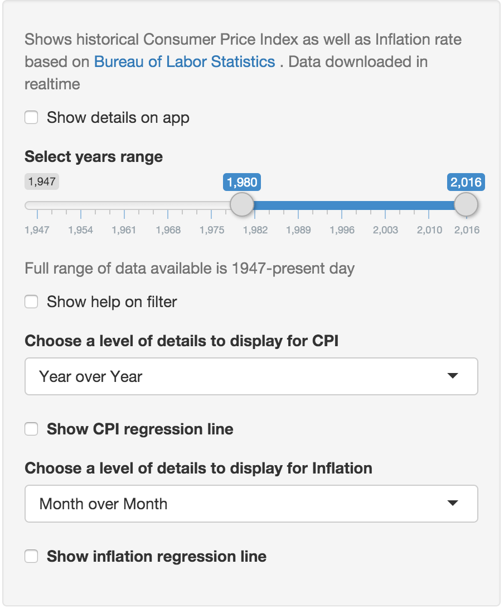

The Consumer Price Index and Inflation in USA Analysis App
========================================================
author: Alexey Maloletkin   
date: 02/14/2016
autosize: true

What this App is about?
========================================================

This app allow you quickly visualize Consumer Price Index (**CPI**) data available from Bureau of Labor Statistics  
It is also calculate inflation rate based on CPI.  
Link to app https://alexey.shinyapps.io/aam044-cpi-inflaton/

## Key Features:
- Realtime data from BLS
- Calculating inflation year over year and month over month
- Caclulate regression for both CPI and inflation/plot line
- Dynamicaly adjustble labels on plots 


Introduction to Filter Panel
=======================================================
title: false

***
To get help - check **Show details on app** or **Show help on filter**   
To select years range - use **Select years range** slider. Default range is 1980-2016  
To change level of details (month/year) - use **Level of details** drop-down


About Data 
========================================================
title: true


```r
cpi_data <- read_tsv(
    file="http://download.bls.gov/pub/time.series/cu/cu.data.1.AllItems",
    skip=0)

cpi_data<-cpi_data[cpi_data$series_id=='CUSR0000SA0',]
```


```r
summary(cpi_data)
```

```
  series_id              year         period              value       
 Length:828         Min.   :1947   Length:828         Min.   : 21.48  
 Class :character   1st Qu.:1964   Class :character   1st Qu.: 30.95  
 Mode  :character   Median :1981   Mode  :character   Median : 91.00  
                    Mean   :1981                      Mean   :102.11  
                    3rd Qu.:1998                      3rd Qu.:163.60  
                    Max.   :2015                      Max.   :238.11  
 footnote_codes    
 Length:828        
 Class :character  
 Mode  :character  
                   
                   
                   
```

Inflation Calculation
========================================================

To calculate inflation we use following formula

$$
  \begin{aligned}
  Inflation_{n,m} = \frac{cpi_{n}-cpi_{m}}{cpi_{m}}*100
  \end{aligned}
$$
where $cpi_{n}$ - consumer price index at period $n$

## References  
[Bureau of Labor Statistics][ref1]  
[Inflation Calculator][ref2]  
[Consumer Price Index Factsheet][ref3]  
[Link to application][app]  

[ref1]: <http://www.bls.gov/cpi/data.htm>
[ref2]: <http://www.bls.gov/data/inflation_calculator.htm>
[ref3]: <http://www.bls.gov/cpi/factsheets.htm>
[app]: <https://alexey.shinyapps.io/aam044-cpi-inflaton/>


